````md
# Curvvtech Smart Device Backend

A clean, scalable Node.js (TypeScript) backend for a Smart Device Management Platform with JWT auth, device CRUD, logs, analytics, rate limiting, background jobs, tests, and Docker.

## Tech Stack

- Node.js + Express (TypeScript)
- MongoDB + Mongoose
- JWT for auth
- Zod for validation
- Jest + Supertest + mongodb-memory-server for tests
- Docker & docker-compose

## Quick Start (Local)

```bash
cp .env.example .env
npm i
npm run dev
# API on http://localhost:4000
```
````

## Quick Start (Docker)

```bash
docker compose up --build
# API on http://localhost:4000
```

## Environment

- `PORT` (default 4000)
- `MONGO_URI` (e.g., mongodb://localhost:27017/curvvtech)
- `JWT_SECRET` (required in production)
- `JWT_EXPIRES_IN` (e.g., 7d)
- `RATE_LIMIT_PER_MIN` (default 100)

## API

### Auth

- **POST /auth/signup** → Create account
  - Body: `{ name, email, password, role? }`
  - 201 → `{ success: true, message: "User registered successfully" }`
- **POST /auth/login** → Login
  - Body: `{ email, password }`
  - 200 → `{ success: true, token, user }`

### Devices (Auth required: `Authorization: Bearer <token>`)

- **POST /devices** → Register device
  - Body: `{ name, type, status? }`
- **GET /devices?type=&status=** → List with filters
- **PATCH /devices/:id** → Update
- **DELETE /devices/:id** → Remove
- **POST /devices/:id/heartbeat** → Update `last_active_at` and optional status

### Logs & Analytics (Auth required)

- **POST /devices/:id/logs** → Create log entry
  - Body: `{ event, value?, timestamp? }`
- **GET /devices/:id/logs?limit=10** → Last N logs
- **GET /devices/:id/usage?range=24h|7d** → Aggregated usage (sums `value` for `event=units_consumed`)

## Security & Best Practices

- Helmet, CORS, compression, rate limiting per user/IP
- Zod validation & centralized error handling
- Passwords hashed with bcrypt
- JWT with short, configurable expiry

## Background Job

- Cron runs every 30 minutes to auto-deactivate devices whose `last_active_at` is older than 24h.

## Tests

- `npm test` runs unit/integration tests in an in-memory MongoDB. See `tests/`.

## Assumptions

- Device ownership is enforced by user-scoped queries.
- Usage aggregation sums `value` of logs where `event === 'units_consumed'`.
- `type` is a small enum; extend as needed.

## Project Structure

```
src/
  config/ env.ts, db.ts
  controllers/ *.controller.ts
  services/ *.service.ts
  models/ User.ts, Device.ts, Log.ts
  routes/ auth.routes.ts, device.routes.ts, log.routes.ts
  middleware/ auth.ts, validate.ts, rateLimit.ts, errorHandler.ts
  schemas/ zod schemas
  jobs/ deactivateStaleDevices.ts
  app.ts, server.ts
```

## POSTMAN IMAGES

### Signup

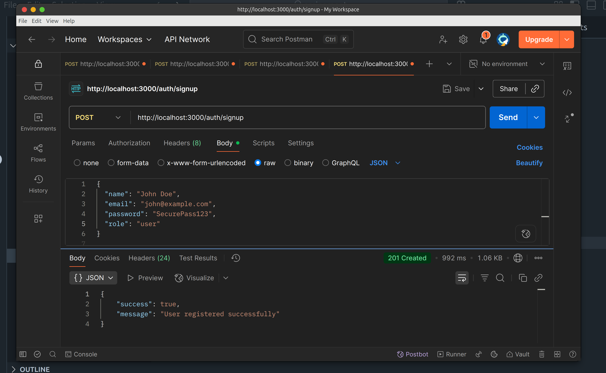

### Login

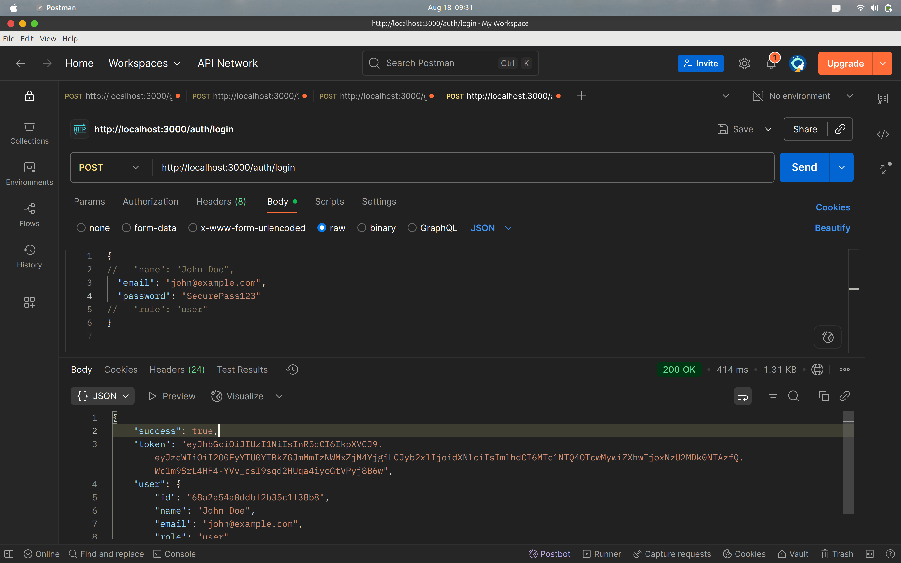

### Delete Device

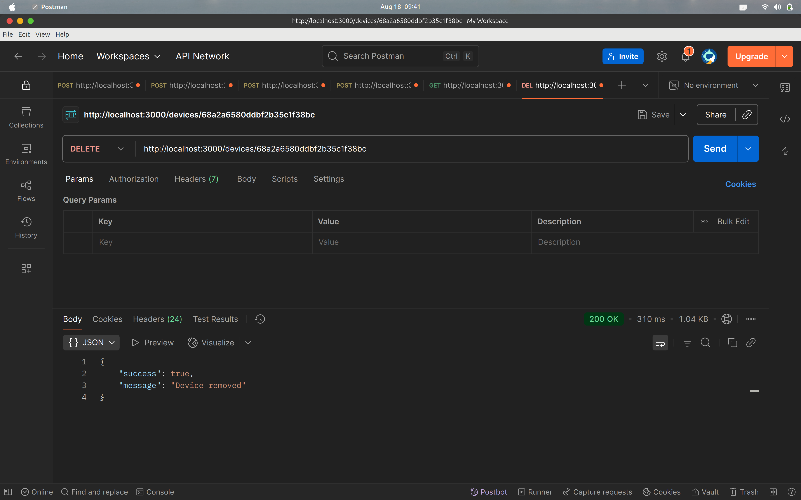

### Get Device

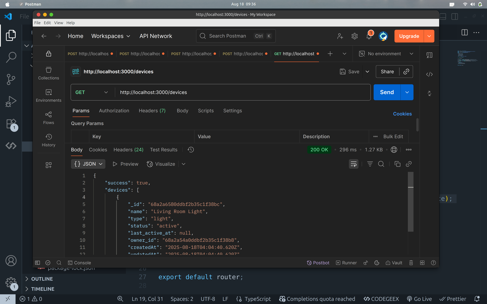

### Device Create

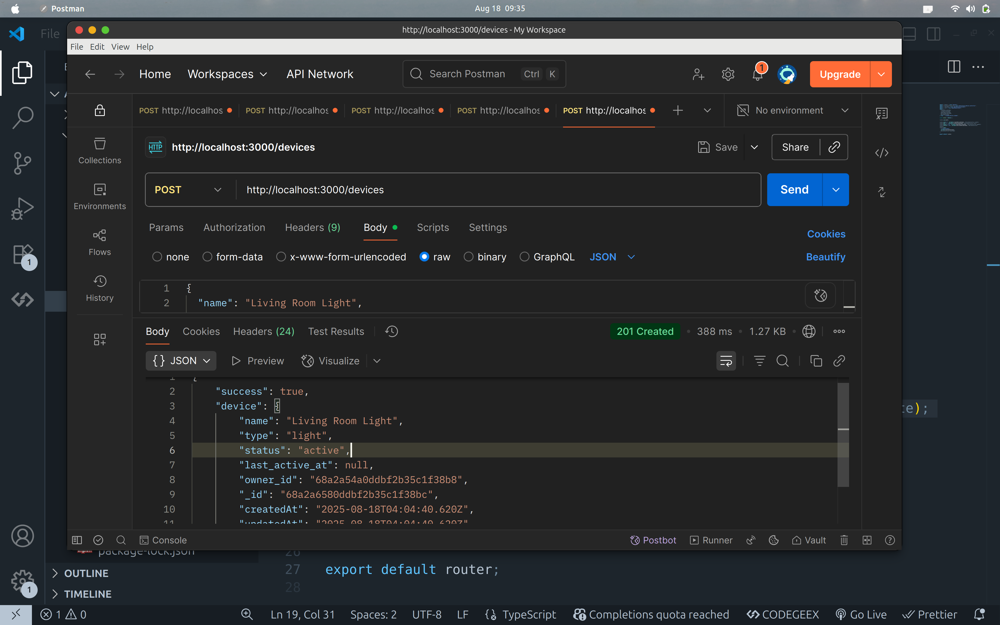

### Device Heartbeat

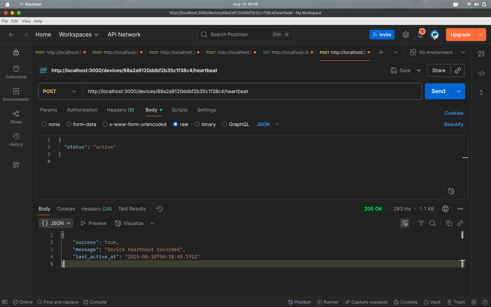

### Logs Create

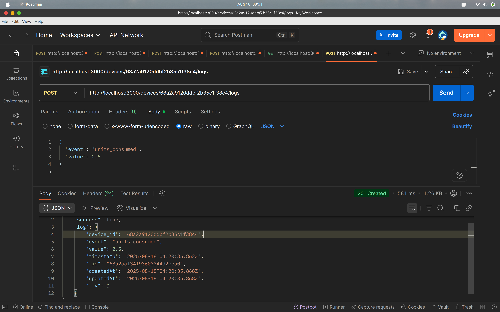

### Logs Get

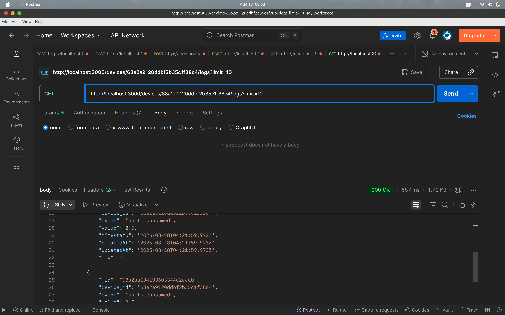

### Logs Usage

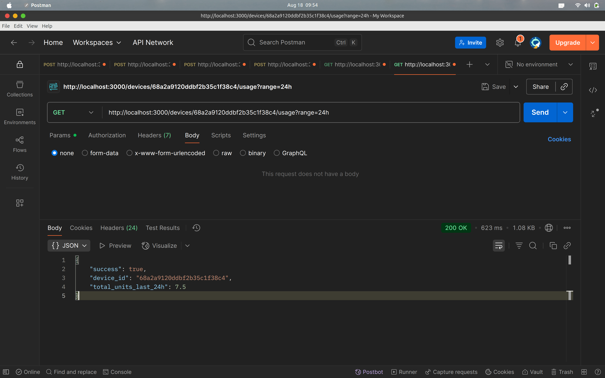

### Patch Device

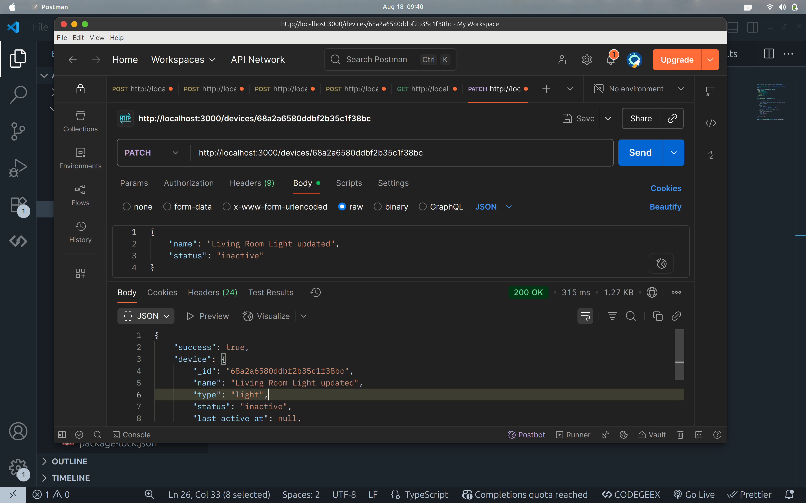

### Testcase Pass

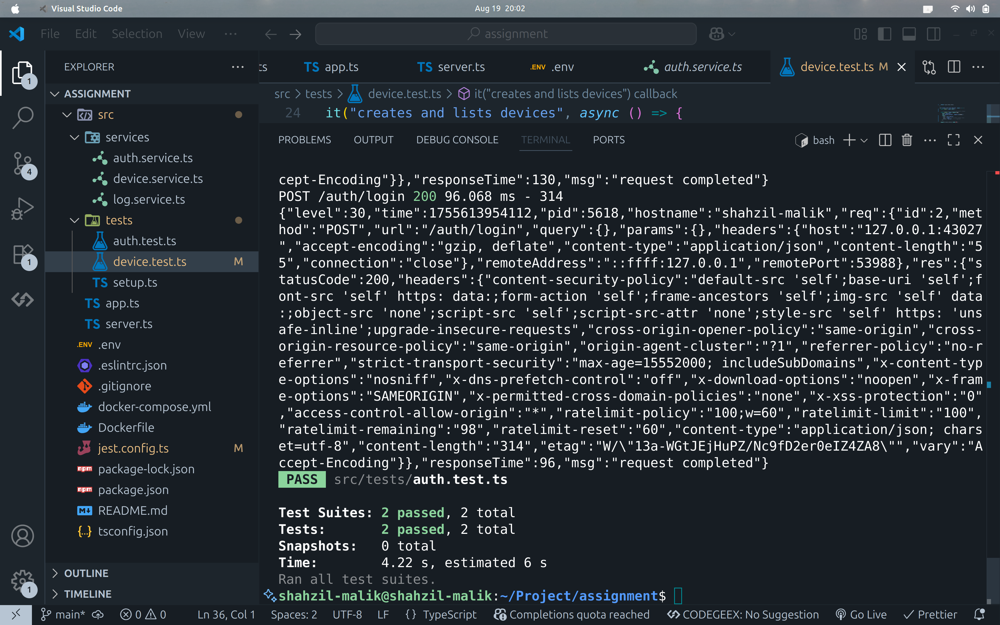
